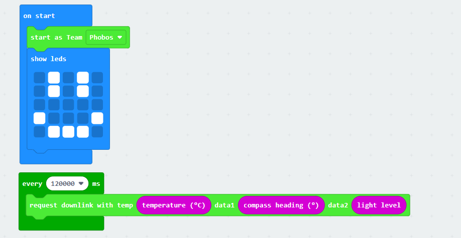

# S4 Communication

This is a MakeCode library designed to interface with the EyeStar 4 radio module on a balloon or satellite. It is intended for students to send payload data to a master micro:bit, which handles communication with the EyeStar 4 (S4) radio.

---

## Overview

The `S4comms` namespace provides blocks to initialize the radio and send data packets containing sensor or payload information. These packets are sent as radio buffers to a master micro:bit for processing.

---

## Blocks and Functions

### `init(id: number, frequency: number)`

- **Purpose:** Initializes the radio settings.
- **Parameters:**
  - `id`: Payload identifier (0–255), used to identify the sending device.
  - `frequency`: Interval in milliseconds between each payload transmission.
- **Usage:** Place this block in the start-up section of your program to set up the radio and transmission timing.

### `downlink(temp: number, data1: number, data2: number, data3: number)`

- **Purpose:** Sends a downlink packet if enough time has passed since the last transmission.
- **Parameters:**
  - `temp`: Temperature value included in the packet (range: -128 to 127).
  - `data1`, `data2`, `data3`: Additional signed short data values to include in the payload.
- **Usage:** Call this block repeatedly; it will only send the data if the configured time interval has elapsed.

---

## Packet Format

Each packet sent contains 8 bytes structured as follows:

| Byte(s) | Description            | Format               |
|---------|------------------------|----------------------|
| 0       | Student ID             | Unsigned 8-bit       |
| 1       | Temperature            | Signed 8-bit         |
| 2 - 3   | Data 1                 | Signed 16-bit (big-endian) |
| 4 - 5   | Data 2                 | Signed 16-bit (big-endian) |
| 6 - 7   | Data 3                 | Signed 16-bit (big-endian) |

Values are clamped to valid ranges to ensure packet integrity.

---

## Example Usage

